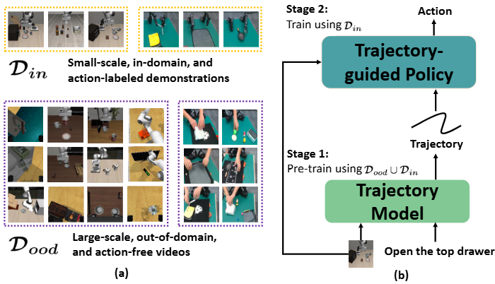

## [CVPR 2025] [Tra-MoE: Learning Trajectory Prediction Model from Multiple Domains for Adaptive Policy Conditioning](https://arxiv.org/abs/2411.14519)



## Low-Cost Dual-Arm Robot Demos

The videos are all done automatically by learned policies.

| Fold | Pick and Pass | Pour |
| --------- | ---------- | ----------- |
|  |  |  |

| Pull out | Push |
| --------- | ---------- |
|  |  |


## Prepare

- Following [ATM](https://github.com/Large-Trajectory-Model/ATM/tree/main), install environment (including [robomimic](https://github.com/ARISE-Initiative/robomimic/tree/5dee58f9cc1235010d0877142b54d0e82dd23986) and [robosuite](https://github.com/ARISE-Initiative/robosuite/tree/eafb81f54ffc104f905ee48a16bb15f059176ad3)).

```
conda env create -f environment.yml
conda activate atm
mkdir third_party & cd third_party
git clone https://github.com/ARISE-Initiative/robomimic.git
git clone https://github.com/ARISE-Initiative/robosuite.git
pip install -e third_party/robosuite/
pip install -e third_party/robomimic/
```


- Downloading and processing [libero](https://github.com/Lifelong-Robot-Learning/LIBERO) data.

